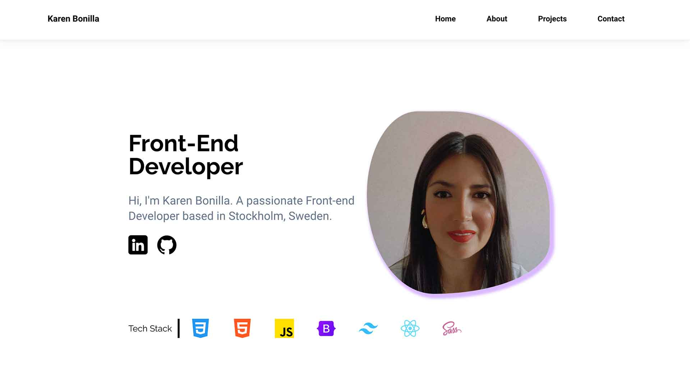

# 2024-05-26_project-exam-2_Karen-Bonilla

Karen Bonilla's Portfolio Website

Welcome to my portfolio website! This site showcases my projects, skills, and experience as a front-end developer

OVERVIEW

This portfolio website serves as a platform to highlight my professional background, skills, and projects. It includes sections such as:

- About Me: A brief introduction to who I am and my career journey.
- Projects: Details about various projects I've worked on, including descriptions, technologies used, and links to live demos or GitHub repositories.
- Skills: Overview of technical skills and expertise.
- Contact: Ways to reach out to me for collaboration or inquiries.

FEATURES

- Responsive Design: Ensures a seamless experience across all devices.
- Project Showcase: Displays projects with descriptions, and links.
- Contact Me: Visitors have access to my email and phone number to be able to contact me.
- Interactive Elements: Smooth animations and transitions to enhance user experience.

TECHNOLOGIES USED

- React 18.2.0: A JavaScript library for building user interfaces.
- Tailwind CSS 3.4.3: A utility-first CSS framework for rapid UI development.
- React Router Dom 6.22.3: For routing and navigation within the application.
- Version Control: Git, GitHub

GETTING STARTED

Prerequisites

- Node.js (v14.x or later)
- npm (v6.x or later) or yarn (v1.x or later)

Installation

- Clone the repository to your local machine:
  git clone https://github.com/KarenBonillaM/2024-06-09_porfolio-2_karen-bonilla.git

- Install dependencies.
  npm install

- Start the development server:
  npm start

- Open your browser and visit:
  (http://localhost:3000)

- Explore different sections of the website:

Click the Live Demo icon to view details and website.

Contact

This project was created by Karen Sofia Bonilla Moreno.
karenbonillamoreno@gmail.com
GitHub Profile: https://github.com/KarenBonillaM

License
